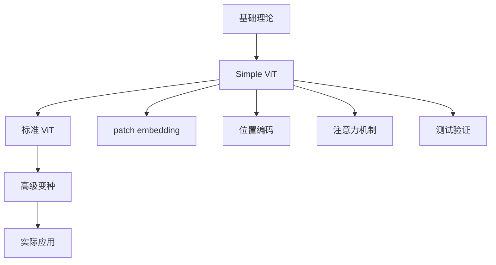

# Vision Transformer 教程集合

欢迎来到 Vision Transformer 教程集合！这里提供了系统性的学习资料，帮助你深入理解和掌握 Vision Transformer 技术。

## 📚 教程列表

### 01. Simple Vision Transformer 教程
- **文件**: `01_SimpleViT_Tutorial.md`
- **代码**: `../vit_pytorch/simple_vit.py`
- **测试**: `../test/01-simple_vit.py`

**内容概览**：
- ✅ Simple ViT 的完整实现和详细注释
- ✅ 理论基础和数学原理解释
- ✅ 测试用例和验证方法
- ✅ 实践练习和常见问题解答
- ✅ 进阶学习路径指导

## 🎯 学习路径



## 🚀 快速开始

### 1. 环境准备
```bash
# 安装依赖
pip install torch torchvision
pip install einops
```

### 2. 运行测试
```bash
# 进入项目根目录
cd pytorch-examples/vit-pytorch

# 运行Simple ViT测试
python test/01-simple_vit.py
```

### 3. 学习顺序
1. **阅读教程**: 从 `01_SimpleViT_Tutorial.md` 开始
2. **理解代码**: 学习 `../vit_pytorch/simple_vit.py` 中的详细注释
3. **运行测试**: 执行测试用例，验证理解
4. **实践练习**: 完成教程中的练习题
5. **扩展学习**: 探索更多ViT变种

## 📁 文件结构

```
vit_pytorch/
├── simple_vit.py               # 详细注释的 Simple ViT 实现
└── [其他ViT变种实现...]

tutorial/
├── README.md                    # 本文件，教程总览
├── 01_SimpleViT_Tutorial.md     # Simple ViT 完整教程
└── [更多教程待添加...]

test/
├── 01-simple_vit.py            # Simple ViT 测试用例
└── [更多测试待添加...]
```

## 🎪 教程特色

### 📖 详细注释
每行关键代码都有中文注释，解释其作用和原理。

### 🧪 完整测试
提供全面的测试用例，验证模型的正确性和稳定性。

### 💡 实践导向
不仅有理论解释，更有实际的代码实现和运行示例。

### 🔗 系统性学习
从基础概念到高级应用，提供完整的学习路径。

## 🎯 学习目标

通过这些教程，你将能够：

- ✅ **理解原理**: 深入理解 Vision Transformer 的核心思想
- ✅ **掌握实现**: 能够从零实现各种 ViT 变种
- ✅ **调试测试**: 学会如何测试和调试 ViT 模型
- ✅ **实际应用**: 在真实项目中应用 ViT 技术
- ✅ **进阶研究**: 为深入研究 ViT 奠定基础

## 🤝 贡献指南

欢迎为教程贡献内容！

### 贡献方式
1. **修复错误**: 发现教程中的错误或不清楚的地方
2. **添加示例**: 提供更多的实践示例
3. **新增教程**: 创建新的ViT变种教程
4. **改进测试**: 增加更多的测试用例

### 教程编写规范
- 使用中文编写，便于理解
- 提供详细的代码注释
- 包含完整的测试用例
- 结合理论和实践
- 提供实践练习

## 📞 联系我们

如果你在学习过程中遇到问题，可以：

1. **查看常见问题**: 每个教程都有FAQ部分
2. **运行测试用例**: 通过测试验证你的理解
3. **参考原始项目**: 查看vit-pytorch项目的完整实现

## 🌟 致谢

本教程基于以下优秀的开源项目：

- [vit-pytorch](https://github.com/lucidrains/vit-pytorch) - Phil Wang的ViT实现
- [Vision Transformer论文](https://arxiv.org/abs/2010.11929) - Google Research
- [Attention Is All You Need](https://arxiv.org/abs/1706.03762) - Transformer原论文

## 📜 许可证

本教程遵循原项目的许可证，仅用于学习和研究目的。

---

**开始你的 Vision Transformer 学习之旅吧！** 🚀

记住：**实践出真知**，边学边做，才能真正掌握这些技术。 